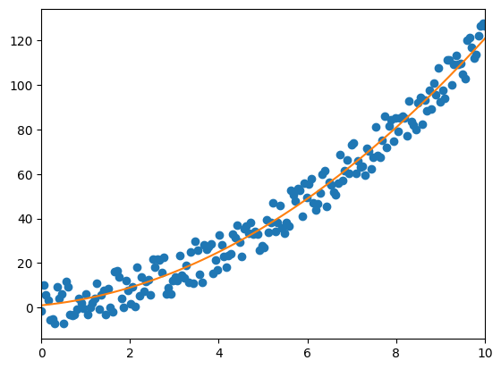
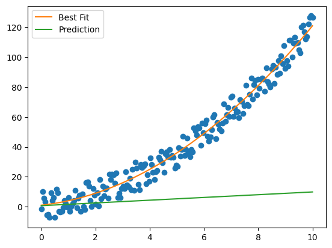
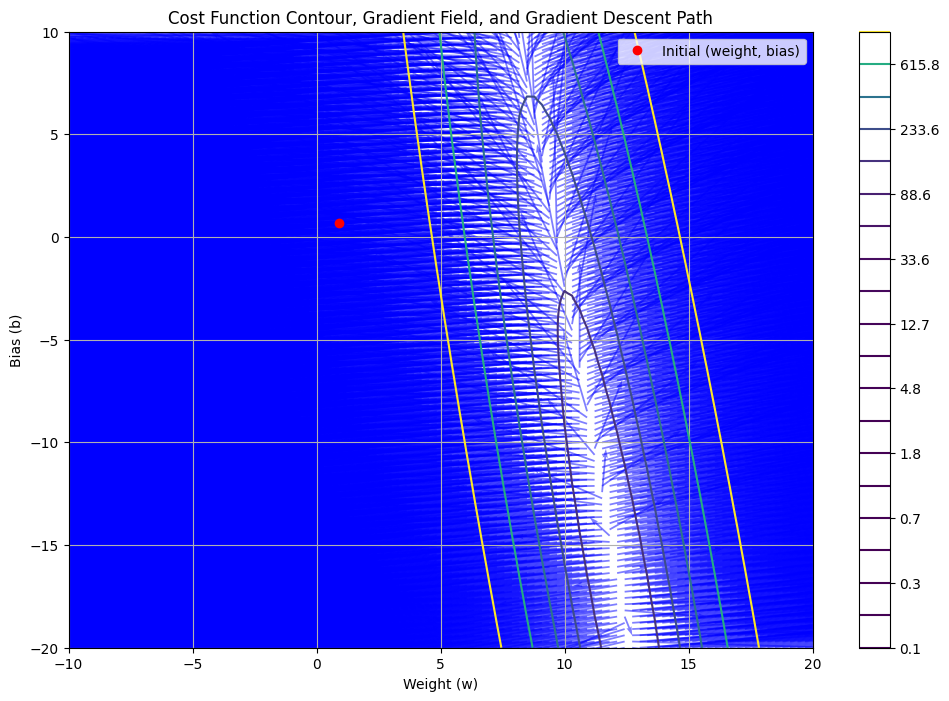
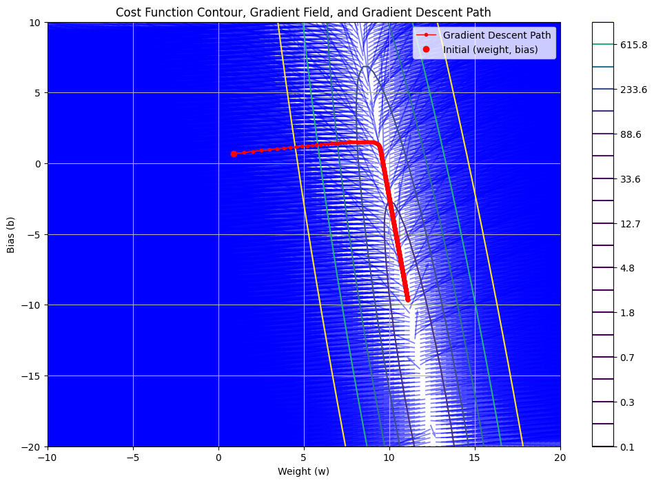
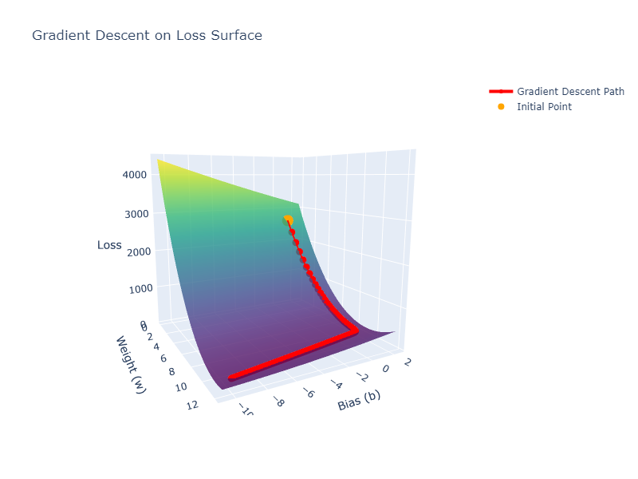
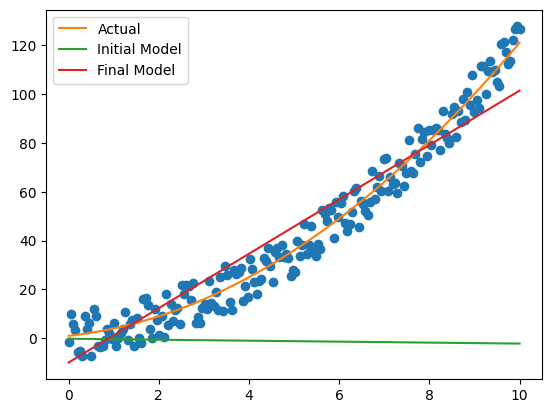
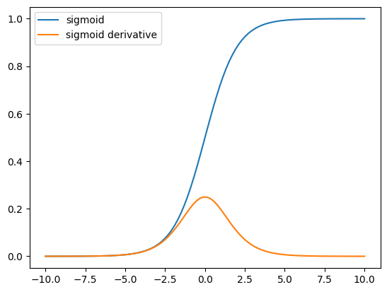
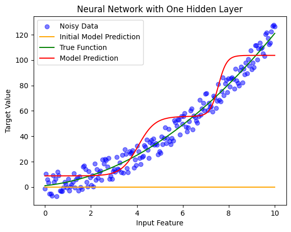
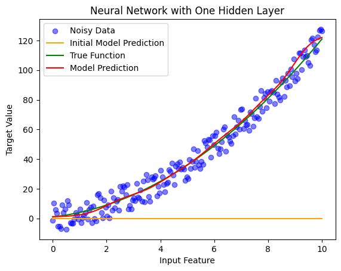

# Differential Geometry & Machine-Learning
Samuel Cavazos <br>
DHR Health <br>
[samuel.cavazos@dhr-rgv.com](mailto:samuel.cavazos@dhr-rgv.com?)

## Introduction
The purpose of this project is study the relationship between Machine-Learning and Differential Geometry. By understanding this relationship, we obtain a better understanding of how machine-learning works and gain the ability to apply concepts from differential geometry while building models.


## Linear Regression
We begin with linear regression to gain understanding. Let's construct some data to work with that follows a somewhat linear trend and build a machine-learning model from scratch. We'll take the function $f(x) = x^2 + 2\cdot x + 1$ over a random sample of points in $[0,10]$ and add some uniform noise. 


```python

def f(x):
    return x**2 + 2*x + 1

# Plot using matplotlib
import matplotlib.pyplot as plt
import numpy as np
import random

# Define the true function
def f(x):
    return x**2 + 2*x + 1

# Generate data
np.random.seed(42)
x = np.linspace(0, 10, 200)
y_true = f(x)
y_data = y_true + np.random.uniform(-10, 10, size=x.shape)

# Plot from 0 to 10
plt.xlim(0, 10)
plt.plot(x, y_data, 'o')
plt.plot(x, y_true)
plt.show()
```


    

    


In the image above, the *best fit* is the function we used to construct the data. Of course, we usually don't know the equation for the best fit beforehand, but we want our model to approximate this line as closely as possible. 

Let us start by constructing a simple machine-learning model for linear regression with no hidden layers, which essentially means there are no intermediate computations between the input and the output in our model.

Our goal is to build a machine-learning model 
$M:[0,10]\to\mathbb{R}$ of the form $$M(x) = \mathbf{W}\cdot x + \mathbf{b},$$ where $\mathbf{W}\in\mathbb{R}$ and $\mathbf{b}\in\mathbb{R}$. Here, $\mathbf{W}$ is called the **weight** and $\mathbf{b}$ is called the **bias**.   

In machine-learning, a model is initialized with random weights and biases, which are then corrected during training by minimizing a **loss function**. Let's start by choosing some random $\mathbf{W}$ and $\mathbf{b}$.


```python
# Initialize parameters
w = random.uniform(-1, 1)  # Random initial weight
b = random.uniform(-1, 1)  # Random initial bias


print(f'Initial weight: {w}')
print(f'Initial bias: {b}')
```

    Initial weight: 0.918163880835746
    Initial bias: 0.6882870252000235
    

Given that the weight and bias was chosen at random, we don't expect it to perform very well on our data, and indeed that is the case, as shown in the image below.


```python
# Linear model
def linear_model(x, w, b):
    return w * x + b

y_pred = [linear_model(p, w, b) for p in x]

plt.plot(x, y_data, 'o')
plt.plot(x, y_true, label='Best Fit')
plt.plot(x, y_pred, label='Prediction')
plt.legend()
plt.show()
```


    

    


Let's work on improving the model. Improving our model will involve tweaking $\mathbf{W}$ and $\mathbf{b}$ to better fit the model using a process called **Gradient Descent**.

To do this, we first define a **loss function** to measure how our model is performing. There are a few ways of doing this, but we'll use the tried and true **Mean Squared Error**:

$$\mathcal{L} = MSE = \frac{1}{N}\sum_{i=1}^N\left(y_\text{i,pred} - y_\text{i,true}\right)^2.$$


```python
# Mean Squared Error Loss
def mse_loss(y_pred, y_true):
    return np.mean((y_pred - y_true)**2)

print(f'50th sample target: {y_data[50]}')
print(f'50th prediction: {y_pred[50]}')
print(f'Loss at 50th sample: {mse_loss(y_pred[50], y_data[50])}')

print('Total Loss over all samples:', mse_loss(np.array(y_pred), np.array(y_data)))
```

    50th sample target: 21.729790078081002
    50th prediction: 2.995231449410441
    Loss at 50th sample: 350.9836870110946
    Total Loss over all samples: 2660.1490298370586
    

Our goal is to minimize this loss function. 

One thing to note about this loss function is that it is a differentiable function. Recal from vector calculus that the **gradient** of a differentiable funtion $f$ is a vector field $\nabla f$ whose value at point $p$ is a vector that points towards the direction of steepest ascent. 

Understanding the gradients of the loss function with respect to the model parameters—specifically, the weight $\mathbf{W}$ and bias $\mathbf{b}$—is crucial in machine learning, particularly when employing optimization techniques like gradient descent. Our goal is to minimize the loss function. 

The gradients $\frac{\partial \mathcal{L}}{\partial \mathbf{W}}$ and $\frac{\partial \mathcal{L}}{\partial \mathbf{b}}$ indicate how sensitive the loss function $\mathcal{L}$ is to changes in the parameters $\mathbf{W}$ and $\mathbf{b}$. In essence, they provide the direction and rate at which $\mathcal{L}$ increases or decreases as we adjust these parameters.

By computing these gradients, we can iteratively update $\mathbf{W}$ and $\mathbf{b}$ to minimize the loss function, thereby improving the model's performance. This process is the foundation of the gradient descent optimization algorithm.

**Intuition Behind the Gradients**

1. **Gradient with Respect to Weight $\mathbf{W}$:**

   The partial derivative $\frac{\partial \mathcal{L}}{\partial \mathbf{W}}$ measures how the loss changes concerning the weight $\mathbf{W}$. A positive derivative suggests that increasing $\mathbf{W}$ will increase the loss, while a negative derivative indicates that increasing $\mathbf{W}$ will decrease the loss. By moving $\mathbf{W}$ in the direction opposite to the gradient, we can reduce the loss.

   If $x_i$ is the i-th data point, let $y_{i,\text{pred}} = \mathbf{W} \cdot x_i + \mathbf{b}$ be the predicted value for the $i$-th data point while $y_{i,\text{true}}$ denotes the true value. Mathematically, this gradient is computed as:

   $$\frac{\partial \mathcal{L}}{\partial \mathbf{W}} = \frac{\partial}{\partial\mathbf{W}}\left( \frac{1}{N}\sum_{i=1}^N(y_{i,\text{pred}} - y_{i,\text{true}})^2\right)$$
   
   $$= \frac{1}{N}\sum_{i=1}^N\frac{\partial}{\partial\mathbf{W}}(y_{i,\text{pred}} - y_{i,\text{true}})^2 \qquad \text{(Additive property of derivatives)}$$
   
   $$= \frac{1}{N}\sum_{i=1}^N\frac{\partial}{\partial\mathbf{W}}((\mathbf{W}\cdot x_i + \mathbf{b}) - y_{i,\text{true}})^2$$
   
   $$= \frac{1}{N}\sum_{i=1}^N 2\cdot((\mathbf{W}\cdot x_i + \mathbf{b}) - y_{i,\text{true}})\cdot (x_i) \qquad \text{(Chain rule)}$$
   
   $$=\frac{2}{N}\sum_{i=1}^N(y_{i,\text{pred}} - y_{i,\text{true}})\cdot x_i.$$

3. **Gradient with Respect to Bias $ \mathbf{b} $:**

   Similarly, the partial derivative $\frac{\partial \mathcal{L}}{\partial \mathbf{b}}$ measures how the loss changes concerning the bias $\mathbf{b}$. Adjusting $\mathbf{b}$ in the direction opposite to this gradient will also help in minimizing the loss.

   This gradient is computed as:
   $$\frac{\partial \mathcal{L}}{\partial \mathbf{b}} = \frac{2}{N}\sum_{i=1}^N(y_{i,\text{pred}} - y_{i,\text{true}}).$$


```python
# Compute gradients
def compute_gradients(x, y_true, w, b):
    y_pred = linear_model(x, w, b)
    error = y_pred - y_true
    dw = 2 * np.mean(error * x)
    db = 2 * np.mean(error)
    return dw, db
```

Now that we have a way of computing the partial derivatives of $\mathcal{L}$ with respect to $\mathbf{W}$ and $\mathbf{b}$, we can visualize the **gradient field**. For a given $p=(\mathbf{W}$, $\mathbf{b}) \in \mathbb{R}^2$, the gradient $\nabla \mathcal{L}$ at $p$ is a vector that points towards the rate of fastest increase. In the following code, we compute these vectors on a grid. We also include a 2D contour plot of the loss function $\mathcal{L}$. Our initial weight $\mathbf{W}$ and bias $\mathbf{b}$ are marked on the plot by a red dot.


```python
import numpy as np
import matplotlib.pyplot as plt

# Gradient Descent parameters
alpha = 0.001  # Learning rate
epochs = 1000  # Number of iterations

# Create a grid of w and b values for contour and quiver plotting
w_vals = np.linspace(-10, 20, 100)
b_vals = np.linspace(-20, 10, 100)
W, B = np.meshgrid(w_vals, b_vals)

# Compute the loss for each combination of w and b in the grid
Z = np.array([mse_loss(linear_model(x, w, b), y_data) for w, b in zip(np.ravel(W), np.ravel(B))])
Z = Z.reshape(W.shape)

# Compute the gradient field
dW = np.zeros(W.shape)
dB = np.zeros(B.shape)
for i in range(W.shape[0]):
    for j in range(W.shape[1]):
        dw, db = compute_gradients(x, y_data, W[i, j], B[i, j])
        dW[i, j] = dw
        dB[i, j] = db

# Plot the cost function contour, gradient field, and gradient descent path
plt.figure(figsize=(12, 8))

# Contour plot of the loss function
cp = plt.contour(W, B, Z, levels=np.logspace(-1, 3, 20), cmap='viridis')
plt.colorbar(cp)
plt.xlabel('Weight (w)')
plt.ylabel('Bias (b)')
plt.title('Cost Function Contour, Gradient Field, and Gradient Descent Path')

# Quiver plot of the gradient field
plt.quiver(W, B, dW, dB, angles='xy', scale_units='xy', scale=1, color='blue', alpha=0.5)
# plot initial weight, bias
plt.plot(w, b, 'ro', label='Initial (weight, bias)')
plt.legend()
plt.grid(True)
plt.show()

```


    

    


Since our goal is to minimize the loss function and these vectors are pointing towards the steepest ascent of the loss function with respect to $\mathbf{W}$ and $\mathbf{b}$, we minimize by moving in the opposite direction of the gradients. This process is fundamental to optimization algorithms like gradient descent and is refered to as **backward propogation** within machine-learning.

**Updating the Parameters:**

The parameter updates are performed iteratively using the following rules:

1. **Weight Update:**
   $$\mathbf{W} \leftarrow \mathbf{W} - \alpha \frac{\partial \mathcal{L}}{\partial \mathbf{W}}$$
   Here, $\alpha$ is the learning rate, a hyperparameter that controls the step size of each update. The term $\frac{\partial \mathcal{L}}{\partial \mathbf{W}}$ represents the gradient of the loss function with respect to the weight. By subtracting this scaled gradient from the current weight, we move $ \mathbf{W} $ in the direction that decreases the loss.

2. **Bias Update:**
   $$\mathbf{b} \leftarrow \mathbf{b} - \alpha \frac{\partial \mathcal{L}}{\partial \mathbf{b}}$$
   Similarly, $\frac{\partial \mathcal{L}}{\partial \mathbf{b}}$ is the gradient of the loss function with respect to the bias. Updating $\mathbf{b}$ in this manner adjusts the model's predictions to better fit the data.

**Intuition Behind the Updates:**

- **Learning Rate $\alpha$:** The learning rate determines how large a step we take in the direction of the negative gradient. A small $\alpha$ leads to slow convergence, while a large $\alpha$ might cause overshooting the minimum, leading to divergence. Choosing an appropriate learning rate is crucial for effective training.

- **Gradient Direction:** The gradients $\frac{\partial \mathcal{L}}{\partial \mathbf{W}}$ and $\frac{\partial \mathcal{L}}{\partial \mathbf{b}}$ indicate the direction in which the loss function increases most rapidly. By moving in the opposite direction (hence the subtraction), we aim to find the parameters that minimize the loss.

We do this over and over again, 2000 times. Each time we do it is referred to as an **epoch**. 

The next step is to update $\mathbf{W}$ and $\mathbf{b}$ to minimize the loss by moving in the direction opposite these gradients. This process is fundamental to optimization algorithms like gradient descent and is known as **backward propogation**.

```python
import numpy as np
import matplotlib.pyplot as plt

# Assuming x and y_data are your input features and target values respectively

# Define the linear model
def linear_model(x, w, b):
    return w * x + b

# Define the loss function (Mean Squared Error)
def mse_loss(y_pred, y_true):
    return np.mean((y_pred - y_true) ** 2)

# Compute gradients
def compute_gradients(x, y_true, w, b):
    y_pred = linear_model(x, w, b)
    error = y_pred - y_true
    dw = 2 * np.mean(error * x)
    db = 2 * np.mean(error)
    return dw, db

# Gradient Descent parameters
alpha = 0.001  # Learning rate
epochs = 2000  # Number of iterations

# Store parameters for plotting
w_history = [w]
b_history = [b]
loss_history = [mse_loss(linear_model(x, w, b), y_data)]

# Gradient Descent loop
for epoch in range(epochs):
    dw, db = compute_gradients(x, y_data, w, b) 
    w = w - alpha * dw # Update the weight
    b = b - alpha * db # Update the bias

    w_history.append(w) # Add to weight tracker
    b_history.append(b) # Add to bias tracker
    loss_history.append(mse_loss(linear_model(x, w, b), y_data)) # Add overall loss to loss tracker

# Convert history lists to numpy arrays for easier slicing
w_history = np.array(w_history)
b_history = np.array(b_history)

# Create a grid of w and b values for contour and quiver plotting
w_vals = np.linspace(-10, 20, 100)
b_vals = np.linspace(-20, 10, 100)
W, B = np.meshgrid(w_vals, b_vals)

# Compute the loss for each combination of w and b in the grid
Z = np.array([mse_loss(linear_model(x, w, b), y_data) for w, b in zip(np.ravel(W), np.ravel(B))])
Z = Z.reshape(W.shape)

# Compute the gradient field
dW = np.zeros(W.shape)
dB = np.zeros(B.shape)
for i in range(W.shape[0]):
    for j in range(W.shape[1]):
        dw, db = compute_gradients(x, y_data, W[i, j], B[i, j])
        dW[i, j] = dw
        dB[i, j] = db

# Print initial (weight, bias)
print(f'Initial (weight, bias): ({w_history[0]}, {b_history[0]})')
# Print final (weight, bias)
print(f'Final (weight, bias): ({w_history[-1]}, {b_history[-1]})')

# Plot the cost function contour, gradient field, and gradient descent path
plt.figure(figsize=(12, 8))

# Contour plot of the loss function
cp = plt.contour(W, B, Z, levels=np.logspace(-1, 3, 20), cmap='viridis')
plt.colorbar(cp)
plt.xlabel('Weight (w)')
plt.ylabel('Bias (b)')
plt.title('Cost Function Contour, Gradient Field, and Gradient Descent Path')

# Quiver plot of the gradient field
plt.quiver(W, B, dW, dB, angles='xy', scale_units='xy', scale=1, color='blue', alpha=0.5)

# Plot the gradient descent path
plt.plot(w_history, b_history, 'ro-', markersize=3, linewidth=1, label='Gradient Descent Path')
# Plot the initial weight, bias
plt.plot(w_history[0], b_history[0], 'ro', label='Initial (weight, bias)')

# Add arrows to indicate direction of descent
for i in range(1, len(w_history)):
    plt.arrow(w_history[i-1], b_history[i-1],
              w_history[i] - w_history[i-1],
              b_history[i] - b_history[i-1],
              head_width=0.05, head_length=0.1, fc='red', ec='red')

plt.legend()
plt.grid(True)
plt.show()

```

    Initial (weight, bias): (0.918163880835746, 0.6882870252000235)
    Final (weight, bias): (11.090173700216313, -9.650829435811533)
    


    

    


Since our weight $\mathbf{W}$ and bias $\mathbf{b}$ together form a point $(\mathbf{W},\mathbf{b})\in\mathbb{R}^2$, the loss function $\mathcal{L}$ forms a 3-dimensional surface. The visualization below shows the path taken during gradient descent on the surface of the loss function $\mathcal{L}$. The initial point $(\mathbf{W},\mathbf{b})$ is in green. The path moves towards $\mathcal{L}$'s minimum.





Finally, we visualize our initial (green) and final (red) linear model on a graph, alongside the data and true line of best fit (orange).


```python
y_initial = [linear_model(p, w_history[0], b_history[0]) for p in x]
y_final = [linear_model(p, w_history[-1], b_history[-1]) for p in x]

plt.plot(x, y_data, 'o')
plt.plot(x, y_true, label = 'Actual')
plt.plot(x, y_initial, label='Initial Model')
plt.plot(x, y_final, label='Final Model')
plt.legend()
plt.show()
```


    

    


# Hidden layers
We can add some complexity to our model by incorporating *hidden layers*, which allows the model to capture more information about the data than merely a single hidden layer. A hidden layer enables the network to learn intermediate representations and approximate more intricate functions beyond simple linear relationships. 

Let's construct a model with a single hidden layer. The input is mapped into a higher-dimensional space. The architecture will include:

1. **Input layer:** Takes in our $x$-value and passes it to the hidden layer.
2. **Hidden layer:** Contains multiple neurons, each applying an activation function to introduce non-linearity. For this example, our inputs from $\mathbb{R}^1$ will be mapped into $\mathbb{R}^{1\times 2}$. Here, $2$ is called the **hidden dimension**.
3. **Output layer:** Produces the final prediction

The layers are connected by an **activation function**. An activation function should satisfy the following criteria:

 * **Non-linearity:** The function must be non-linear to allow the neural network to model complex relationships.
 * **Differentiability:** The function should be differentiable to facilitate gradient-based optimization methods like **backpropogation**.
 * **Bounded output:** Having a bounded output helps in stabilizing the learning process and prevents extreme activations.
 * **Monotonicity:** A monotonic function ensures consistent gradients, aiding in stable and efficient training.
 * **Computational efficiency:** The function should be computationally simple to evaluate, ensuring efficient training and inference. 

A good example of such a function is the *sigmoid* activation function, defined as 
$$\sigma(z) = \frac{1}{1+ e^{-z}}.$$

It is non-linear monotonic, smooth and differentiable function, and is bounded between $0$ and $1$.


```python
# Activation function and its derivative
def sigmoid(z):
    return 1 / (1 + np.exp(-z))

def sigmoid_derivative(z):
    return sigmoid(z) * (1 - sigmoid(z))

# Plot 
z = np.linspace(-10, 10, 100)
plt.plot(z, sigmoid(z), label='sigmoid')
plt.plot(z, sigmoid_derivative(z), label='sigmoid derivative')
plt.legend()
plt.show()

```


    

    


To enhance our model's capacity to capture complex patterns, we introduce a hidden layer into the neural network. This addition allows the model to learn intermediate representations, enabling it to approximate more intricate functions beyond simple linear relationships.

**Mathematical Formulation:**

Given an input $x \in [0, 10]$, the model $M$ processes $x$ as follows:

1. **Linear Transformation to Hidden Layer:**
   - Transform the input $x$ to the hidden layer:
     $$z_1 = \mathbf{W}_i \cdot x + \mathbf{b}_i$$
     where:
     - $\mathbf{W}_i \in \mathbb{R}^{2 \times 1}$ is the weight matrix.
     - $\mathbf{b}_i \in \mathbb{R}^{2 \times 1}$ is the bias vector.

2. **Activation Function:**
   - Apply the sigmoid activation function element-wise to $z_1$:
     $$a_1 = \sigma(z_1) = \frac{1}{1 + e^{-z_1}}$$
     resulting in $a_1 \in \mathbb{R}^{2 \times 1}$.

3. **Output Layer:**
   - Compute the output prediction:
     $$y_{\text{pred}}=\mathbf{W}_o\cdot a_1+b_o$$
     where:
     - $\mathbf{W}_o \in \mathbb{R}^{1 \times 2}$ is the weight matrix.
     - $b_o \in \mathbb{R}$ is the bias term.

This formulation ensures that matrix dimensions align correctly during computations, adhering to standard neural network notation. 

After we obtain our output, we employ gradient descent to minimize the loss function, adjusting the weights and biases to improve the model's performance.


```python
import numpy as np
import matplotlib.pyplot as plt
import random

# Reshape data for neural network
x = x.reshape(-1, 1)
y_data = y_data.reshape(-1, 1)

# Initialize parameters
input_dim = x.shape[1]  # Number of input features
hidden_dim = 2         # Number of neurons in the hidden layer
output_dim = y_data.shape[1]  # Number of output neurons

# Weights and biases
np.random.seed(42)
W1 = np.random.randn(input_dim, hidden_dim) * 0.01
b1 = np.zeros((1, hidden_dim))
W2 = np.random.randn(hidden_dim, output_dim) * 0.01
b2 = np.zeros((1, output_dim))

# Fetch initial model predictions
Z1 = np.dot(x, W1) + b1
A1 = sigmoid(Z1)
Z2 = np.dot(A1, W2) + b2
y_pred_initial = Z2

# Learning rate
alpha = 0.01

# Training loop
epochs = 10000
m = x.shape[0]  # Number of training examples
loss_history = []

for epoch in range(epochs):
    # Forward propagation
    Z1 = np.dot(x, W1) + b1
    A1 = sigmoid(Z1)
    Z2 = np.dot(A1, W2) + b2
    y_pred = Z2  # Linear activation for output layer

    # Compute loss (Mean Squared Error)
    loss = (1 / (2 * m)) * np.sum((y_pred - y_data) ** 2)
    loss_history.append(loss)

    # Backward propagation
    dZ2 = y_pred - y_data
    dW2 = (1 / m) * np.dot(A1.T, dZ2)
    db2 = (1 / m) * np.sum(dZ2, axis=0, keepdims=True)
    dA1 = np.dot(dZ2, W2.T)
    dZ1 = dA1 * sigmoid_derivative(Z1)
    dW1 = (1 / m) * np.dot(x.T, dZ1)
    db1 = (1 / m) * np.sum(dZ1, axis=0, keepdims=True)

    # Update parameters
    W1 = W1 - alpha * dW1
    b1 = b1 - alpha * db1
    W2 = W2 - alpha * dW2
    b2 =  b2 - alpha * db2

    # Print loss every 1000 epochs
    if epoch % 1000 == 0:
        print(f'Epoch {epoch}, Loss: {loss}')

# Predictions
Z1 = np.dot(x, W1) + b1
A1 = sigmoid(Z1)
Z2 = np.dot(A1, W2) + b2
y_pred = Z2

# Plotting
plt.scatter(x, y_data, label='Noisy Data', color='blue', alpha=0.5)
plt.plot(x, y_pred_initial, label='Initial Model Prediction', color='orange')
plt.plot(x, y_true, label='True Function', color='green')
plt.plot(x, y_pred, label='Model Prediction', color='red')
plt.xlabel('Input Feature')
plt.ylabel('Target Value')
plt.title('Neural Network with One Hidden Layer')
plt.legend()
plt.show()

```

    Epoch 0, Loss: 1638.6673807594236
    Epoch 1000, Loss: 167.82484824493312
    Epoch 2000, Loss: 69.60049143526598
    Epoch 3000, Loss: 66.6710968666722
    Epoch 4000, Loss: 63.20828385934484
    Epoch 5000, Loss: 59.88668042500685
    Epoch 6000, Loss: 57.94048495991971
    Epoch 7000, Loss: 57.97012639469517
    Epoch 8000, Loss: 68.42402931252558
    Epoch 9000, Loss: 67.10520664909527
    


    

    


Here, we train a model by mapping inputs into $\mathbb{R}^{1\times 10}$ instead of $\mathbb{R}^{1\times 2}$. This model performs better than the prior two models we have built using this data. 


```python
import numpy as np
import matplotlib.pyplot as plt
import random

# Reshape data for neural network
x = x.reshape(-1, 1)
y_data = y_data.reshape(-1, 1)

# Initialize parameters
input_dim = x.shape[1]  # Number of input features
hidden_dim = 10         # Number of neurons in the hidden layer
output_dim = y_data.shape[1]  # Number of output neurons

# Weights and biases
np.random.seed(42)
W1 = np.random.randn(input_dim, hidden_dim) * 0.01
b1 = np.zeros((1, hidden_dim))
W2 = np.random.randn(hidden_dim, output_dim) * 0.01
b2 = np.zeros((1, output_dim))

# Fetch initial model predictions
Z1 = np.dot(x, W1) + b1
A1 = sigmoid(Z1)
Z2 = np.dot(A1, W2) + b2
y_pred_initial = Z2

# Learning rate
alpha = 0.01

# Training loop
epochs = 10000
m = x.shape[0]  # Number of training examples
loss_history = []

for epoch in range(epochs):
    # Forward propagation
    Z1 = np.dot(x, W1) + b1
    A1 = sigmoid(Z1)
    Z2 = np.dot(A1, W2) + b2
    y_pred = Z2  # Linear activation for output layer

    # Compute loss (Mean Squared Error)
    loss = (1 / (2 * m)) * np.sum((y_pred - y_data) ** 2)
    loss_history.append(loss)

    # Backward propagation
    dZ2 = y_pred - y_data
    dW2 = (1 / m) * np.dot(A1.T, dZ2)
    db2 = (1 / m) * np.sum(dZ2, axis=0, keepdims=True)
    dA1 = np.dot(dZ2, W2.T)
    dZ1 = dA1 * sigmoid_derivative(Z1)
    dW1 = (1 / m) * np.dot(x.T, dZ1)
    db1 = (1 / m) * np.sum(dZ1, axis=0, keepdims=True)

    # Update parameters
    W1 -= alpha * dW1
    b1 -= alpha * db1
    W2 -= alpha * dW2
    b2 -= alpha * db2

    # Print loss every 1000 epochs
    if epoch % 1000 == 0:
        print(f'Epoch {epoch}, Loss: {loss}')

# Predictions
Z1 = np.dot(x, W1) + b1
A1 = sigmoid(Z1)
Z2 = np.dot(A1, W2) + b2
y_pred = Z2

# Plotting
plt.scatter(x, y_data, label='Noisy Data', color='blue', alpha=0.5)
plt.plot(x, y_pred_initial, label='Initial Model Prediction', color='orange')
plt.plot(x, y_true, label='True Function', color='green')
plt.plot(x, y_pred, label='Model Prediction', color='red')
plt.xlabel('Input Feature')
plt.ylabel('Target Value')
plt.title('Neural Network with One Hidden Layer')
plt.legend()
plt.show()

```

    Epoch 0, Loss: 1640.9238288719946
    Epoch 1000, Loss: 76.96374247984966
    Epoch 2000, Loss: 41.5533278003985
    Epoch 3000, Loss: 30.657167775410258
    Epoch 4000, Loss: 26.234088958038857
    Epoch 5000, Loss: 23.64147651087363
    Epoch 6000, Loss: 22.017540549010196
    Epoch 7000, Loss: 20.898178674873815
    Epoch 8000, Loss: 20.088401984130098
    Epoch 9000, Loss: 19.48309466584247
    


    

    

# TO-DO    
    * Expand to multi-dimensional inputs.
    * Convolutional layers
